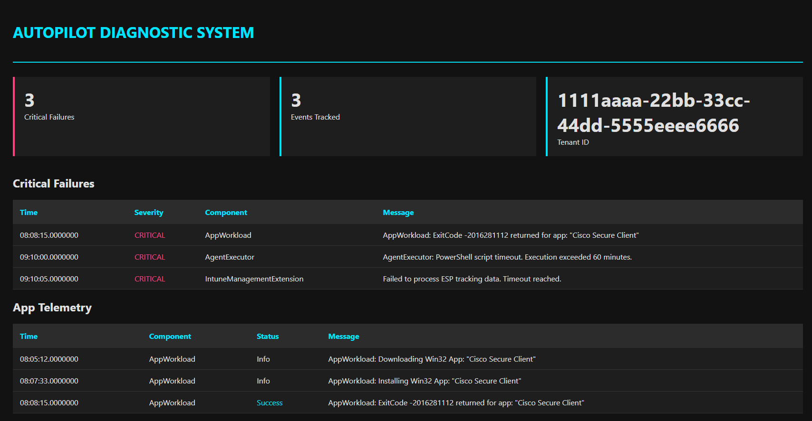

# Autopilot Analyzer - Architect Edition

Autopilot Analyzer is a high-performance PowerShell diagnostic engine designed to transform complex Intune and Autopilot log files into a clean, actionable visual dashboard. It automates the extraction and parsing of MDM, IME, and OS-level Event Logs, reducing troubleshooting time from hours to seconds.

---

## Technical Features

### Dashboard Preview


### App Telemetry Detail


- **Native GUI Integration:** Run the script without parameters to launch a familiar Windows File Explorer prompt for easy log selection.
- **Deep Extraction Engine:** Automatically processes nested `.cab` and `.zip` archives, or accepts raw `.xml`, `.yaml`, and `.log` files.
- **Windows Event Log (.evtx) Parsing:** Natively scans OS-level event logs to detect core failures like TPM attestation, TLS/Schannel blocks, and Time Sync issues.
- **Intelligent Error Mapping:** Correlates hex error codes and Event IDs with plain-English remediation insights.
- **The Architect Dashboard:**
    - **Microsoft Documentation:** Direct links to relevant official troubleshooting guides.
    - **MVP Knowledge Base:** Integrated links to expert articles from community leaders.
    - **Admin Portal Deep-Links:** Context-aware buttons that open the specific Intune or Entra ID blade required to fix the detected error.
    - **App ID Tracking:** Automatically extracts Intune App GUIDs from logs and provides direct links to the application's properties in the Intune portal.
- **Export Capabilities:** Supports raw data export to JSON and CSV for advanced reporting and ticketing integration.

---

## Installation

```powershell
git clone [https://github.com/backuploki/AutopilotAnalyzer.git](https://github.com/backuploki/AutopilotAnalyzer.git)